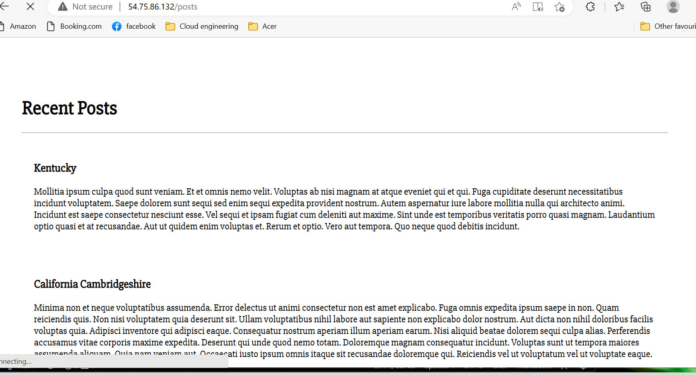

# 2 Tier deployment

- Set up your vpc
- set up your internet gateway
- Connect the IGW to the VPC
- Create public and private subnets
- Create route tables for public and private subnets
- Attach relevent subnets to tables
- Edit public route table for access to the IGW
- Create 2 instances 

### Database

Run the database instance first so the commands in the app instance can connect.

Set up the db server with these commands in the user data:

```
#!/bin/bash

sudo apt-get update -y
sudo apt-get upgrade -y
sudo apt-key adv --keyserver hkp://keyserver.ubuntu.com:80 --recv D68FA50FEA312927
echo "deb https://repo.mongodb.org/apt/ubuntu xenial/mongodb-org/3.2 multiverse" | sudo tee /etc/apt/sources.list.d/mongodb-org-3.2.list
sudo apt-get update -y
sudo apt-get upgrade -y
sudo apt-get install -y mongodb-org=3.2.20 mongodb-org-server=3.2.20 mongodb-org-shell=3.2.20 mongodb-org-mongos=3.2.20 mongodb-org-tools=3.2.20
sudo systemctl start mongod
sudo systemctl enable mongod
sudo sed -i 's/127.0.0.1/0.0.0.0/g' /etc/mongod.conf
sudo systemctl restart mongod
sudo systemctl enable mongod
```


### App

- Create the app instance in your vpc in the public subnet and choose your location.
- Enable auto assign public Ip and create a security group to allow SSH, HTTP and port 3000 if your reverse proxy fails.
- Add the following script to yhe user data to get the dependecies and run the app

```
#!/bin/bash

sudo apt-get update -y

sudo apt-get upgrade -y

sudo apt-get install nginx -y

sudo apt-get install sed -y

sudo apt-get install git -y

echo 'export DB_HOST=mongodb://10.0.3.34:27017/posts' >> /home/ubuntu/.bashrc

source /home/ubuntu/.bashrc

sudo sed -i "s@try_files \$uri \$uri/ =404;@proxy_pass http:\/\/localhost:3000\/;@" /etc/nginx/sites-available/default

sudo sed -i "s/# pass PHP scripts to FastCGI server/location \/posts {\n\t\tproxy_pass http:\/\/localhost:3000\/posts;\n\t}/" /etc/nginx/sites-available/default

sudo systemctl start nginx

sudo systemctl enable nginx

sudo apt-get install -y python-software-properties

curl -sL https://deb.nodesource.com/setup_12.x | sudo -E bash -

sudo apt-get install -y nodejs

git clone https://github.com/shalekabh/app.git /home/ubuntu/repo

cd /home/ubuntu/repo

sudo apt-get install -y npm

sudo npm install

sudo npm install -g pm2

npm install

sudo nginx -t

sudo systemctl restart nginx

sudo systemctl enable nginx

node seeds/seed.js

pm2 stop app.js

pm2 start app.js --update-env
```

run the ip address and /posts page and hopefully it should work.

