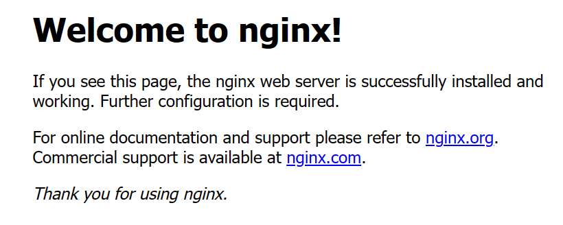
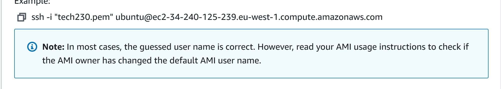
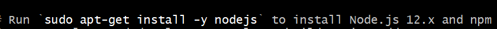

# Creating a launch template

Start off by launching your standard ec2:

Manually install all the dpendencies and resources to run nginx

Test it using the IP:



Then select your instance:


Click the "Actions" drop down menu select "image and templates"


Select create template from instance:

Name and describe the template and keep the rest the same:


"Create Launch Template":

Now terminate your instance:

Now Launch instance from template to see if it works.

Do the same process for your database ec2:

### Copying the files and launching the app

Next we ssh into both terminals, like how we did in the EC2 section:



If needed make sure to update and upgrade and if prompted install nodejs.



We want to be in our app terminal and we want to copy our app files to our ec2 instance. to do this we use the command:

``` scp -i "~/.ssh/tech230.pem" -r C:/Users/shale/tech230_visualisation/teclti_machine/app ubuntu@ec2-54-78-182-137.eu-west-1.compute.amazonaws.com:/home/ubuntu```

This will take a while as it does one file at a time.

Make sure you have the right path to your key and  app folder. Make sure to change the IP address to your ec2 IP.

Manually install the dependencies:

```sudo apt-get install -y python-software-properties```
```curl -sL https://deb.nodesource.com/setup_12.x | sudo -E bash -```
```sudo apt-get install -y nodejs```
```sudo apt-get install -y npm```
```sudo npm install```
```sudo npm install -g pm2```

```cd``` into app and start the app with ```pm2 start app.js```

It will run but you wont be able to see it when you access the webpage, we need to allow port 3000 to be viewed, so we need to add it as an inbound rule for our security group:

Lastly check the IP address and you should see the sparta app running.


Congratulations!
