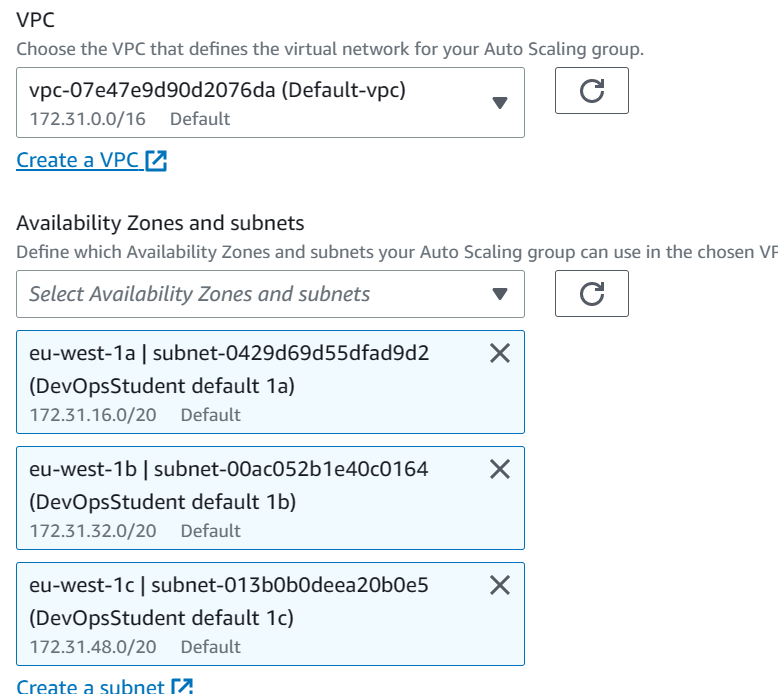
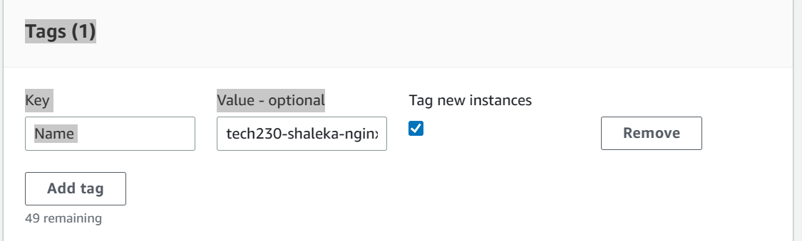
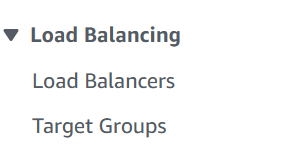

### Create an ec2 instance

First we need to set up an E2 instance so we can create an AMI from it and use that to create a template. So set up and launch an instance:


Select your AMI AND VERSION:


Type and key pair:


Select your security group:


Then select Advanced details and scroll down to user data and set the commands for setting up nginx:


Then at the bottom, after summary, Launch the instance.

### Create a AMI from the instance

once you have checked nginx is running by going to the IP address of your instance:


Then you select your instance, then select the action drop down menu, go to image and templates then create image:


Name it and describe it, keep everything else the same and then create image in the bottom right corner.

### Create launch template

Next on the left hand side, select "Launch template"

then click "create launch template"

Name and describe it.

Then scroll down and click "my ami" or type in the name of your AM you created and use it:


Then set the rest up, exactly like how you set up the Ec2, including the user data (Scroll up and follow steps)

Then select "create launch template"

### Auto scaling group

Now we want to create our auto scaling group, select it from the left side menu:


Then create auto scaling group:


Name it:


select LT:


click "next"

Keep the VPC the default one and make your instances highly available by placing them in multiple availability zones:



Keep the "Instance type requirements" the same as they should be connected to your LT then hit "next"

Now we want to attach our ASG to a load balancer but we dont have one so we need to make a new one, select attach to new balancer make sure we select application load balancer:


Name it and select the otion for internet facing LB:


Next we choose http and port 80 and create a target group to send it to:


Next scroll down and enable health checks then click next:


Configuere the group size:


Set the ASG policies:


click next until you get to tags and set the tag as:



click next, review it and  if youre happy, create the group.

### Load balancer

select load balancer from the left side menu:



type in the name of your LB to see if its there.

if it is then everything has been created!

congratulations


Now we want to create ASG's to launch our app, the process is the same but this is the updated user data:

#!/bin/bash
```
sudo apt-get update -y
sudo apt-get upgrade -y
sudo apt-get install nginx -y
sudo apt install git -y
sudo systemctl start nginx
sudo systemctl enable nginx
sudo apt-get install -y git
curl -sL https://deb.nodesource.com/setup_12.x | sudo -E bash -
sudo apt-get install -y nodejs
git clone https://github.com/shalekabh/app.git
cd app
sudo apt-get install -y npm
sudo npm install
sudo npm install -g pm2
pm2 stop app.js
pm2 start app.js --update-env
```

