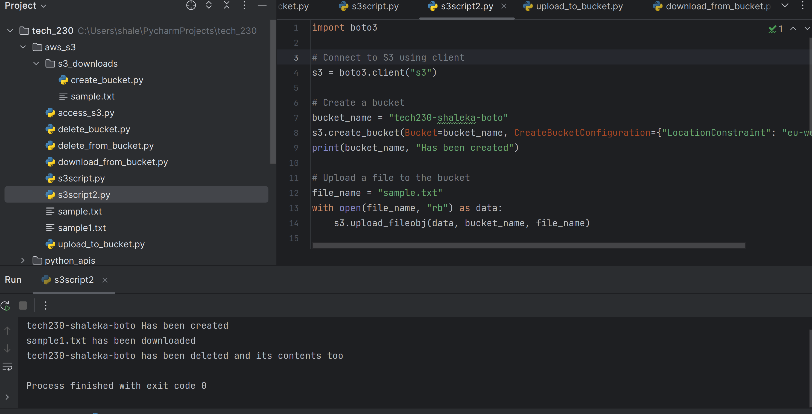
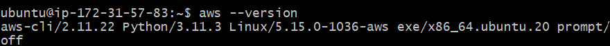

# AWS s3 Buckets

AWS has a storage service called s3, Simple Storage service, it includes data storage, backup, restoration archiving and analytics.

s3 has a gui, on the AWS website or in our case we are using the AWS cli and more specifically, SDK's and boto3 to automate.

# CRUD, Create, Read, Update, Destroy

To install the AWS cli, you can open a terminal or you can use an IDE(intergrated developer environment), in my case ime using Pycharm's terminal and install it using:

```pip install awscli```

Then you have to configure your account, the reason for this is because your account its new:

```aws configure```

Then it will ask you for your Access key and Secret key. DO NOT SHOW THIS TO ANYONE.

After that it ask you for the default region:

```eu-west-1```

Default format type:

```json```

Next we check the bucket list using:

```aws s3 ls```

### Create

To make a new bucket command and naming convention:

aws s3 mb s3://tech230-shaleka-bucket -- region eu-west-1

### Read

To copy a file from your local directory to s3 use:

```aws s3 cp <filename> s3://tech230-shaleka-bucket```

### Update

To download contents of an s3 bucket to a local directory, in our case s3_downloads use:

```aws s3 sync s3://tech230-shaleka-bucket s3_downloads```

### Delete

To remove a file from a bucket:

```aws s3 rm s3://tech230-shaleka-bucket/<filename>```

Remove all contents from a bucket

```aws s3 rm s3://tech230-shaleka-bucket --recursive```

When the bucket is empty, only then can you delete the bucket:

```aws s3 rb tech230-shaleka-bucket```


### Automating the CRUD operations:

We first need to get boto3, again we use pip:

```pip install boto3```

A useful script we can implement is for listing the buckets:

```
import boto3

# Connect to s3
s3 = s3.resources("s3)

# List buckets
for buckets in s3.buckets.all()
    print(bucket.name) 
```


### Automate Create

```
import boto3

# Connect to s3
s3 = s3.client("s3")

# Create an s3 bucket:

bucket_name = s3.create_bucket(Bucket="tech230-shaleka-boto", CreateBucketConfigurateion={"Locationonstraint" : "eu-west-1"})
```

### Automate Read

```
 s3 = boto3.resource("s3")
# Open the file we want to send and store it in a variable called data

data = open("sampletext.txt", "rb")
    
# Specify what bucket we are sending the file to
s3.Bucket("tech230-shaleka-boto").put_object(Key="sampletext.txt", Body=data)
```

`rb` stands for read binary to read the binary format of a file.

### Automate Update

```
import boto3
#
 Connect to S3 client
s3 = boto3.client("s3")

# Download from S3 bucket with bucket name, filename and what you will name it after its downloaded
s3.download_file("tech230-shaleka-boto", "sampletext.txt", "sampletext1.txt")
```

### Automate Delete

We need an empty bucket to be able to delete it so we can use:

```
import boto3

# Connect to S3 resource
s3 = boto3.resource("s3")

# Remove all files
aws s3 rm s3://tech230-shaleka-bucket --recursive

# Delete bucket

bucket = s3.Bucket("tech230-shaleka-boto")
response = bucket.delete()

# Confirm its deleted
print(response)
```

### S3 script.

The following code will create a bucket, upload a file to that bucket, download a file from the bucket, delete the file from the bucket and finally delete the bucket:

```
import boto3

# Connect to S3 using client
s3 = boto3.client("s3")

# Create a bucket
bucket_name = "tech230-shaleka-boto"
s3.create_bucket(Bucket=bucket_name, CreateBucketConfiguration={"LocationConstraint": "eu-west-1"})
print(bucket_name, "has been created")

# Upload a file to the bucket
file_name = "sample.txt"
with open(file_name, "rb") as data:
    s3.upload_fileobj(data, bucket_name, file_name)

# Download a file from the bucket
new_file_name = "sample1.txt"
s3.download_file(bucket_name, file_name, new_file_name)
print(new_file_name, "has been downloaded")

# Delete an object
s3.delete_object(Bucket=bucket_name, Key=file_name)

# Delete a bucket
s3.delete_bucket(Bucket=bucket_name)
print(bucket_name, "has been deleted and all its contents")
```


### Installing aws cli on buntu ec2

We initially need to install AWS CLI and the AWS SDK dependencies for boto3 to run:

```
curl "https://awscli.amazonaws.com/awscli-exe-linux-x86_64.zip" -o "awscliv2.zip"

sudo apt install unzip

unzip awscliv2.zip

sudo ./aws/install
```

run : ```aws --version``` to see if it properly installed:



Next configure the AWS cli (Access, secret keys etc):

```aws configure```

To check you can use AWS CLI you can run a command to list the bucket:

```aws s3 ls```


You can run the same commands from above to CRUD

### Installing boto3 and the venv

Install packages and activate the virtual environment:

```
sudo apt install python3.8-venv

python3 -m venv <env-directory>

source ~/<env-directory>/bin/activate
```


Install pip and use it to install boto3:

```
sudo apt-get install python3-pip

pip install boto3    
```

And to enter python type in :

```python3```

Always check to see if commands work and you can list the buckets using a loop:

```
import boto3

# Connect to S3 resources
s3 = boto3.resource("s3")

# List buckets
for bucket in s3.buckets.all():
    print(bucket.name)
```


# GO UP TO SEE AUTOMATION