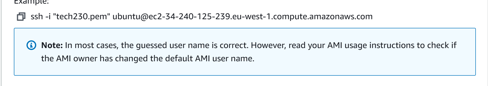

# Setting up an ec2 instance

Once you are logged in, in the top right hand corner, change your location to eu-west-1 Europe(reland):


Then in the search bar, type ec2 and select it from the drop down menu:


You should see this:


Next scroll down to launch instance and from the drop down menu, choose launch instance:


Make a name for your instance and follow the naming convention:


Select your AMI:


Choose the version:


Keep the instance type the same:


Select your key pair:


Select "edit" in network settings:


Scroll down to firewarll security groups and create a new security group:


Set the name ans keep the SG rules the same


Scroll down to summary section and launch instance:


It should say success, then click the inctance id number to take us to our instances page:


It should look like this:


When checks are passed it should look like this:


Next we click the instance id again on the actual instance this time and it will take us to this page:


We click connect and it takes us to this page:


Select the ssh section and follow the steps.

Launch a gitbash and ```cd``` to .ssh and ```ls``` to see the files:


Give yourself permission for the key:


Then copy the code from here and enter it into your terminal:



It should ask to keep your fingerprint, when prompted say yes and it should look like this:


Then update and upgrade using :

```sudo apt update -y``` and ```sudo apt upgrade - y```

Then install, start and enable nginx:

```sudo apt install nginx -y```, ```sudo systemctl start nginx``` and ```sudo systemctl enable nginx```

Go back to you instance, copy and paste the IP into the URL and it should bring up the nginx home page!

Congratulations!