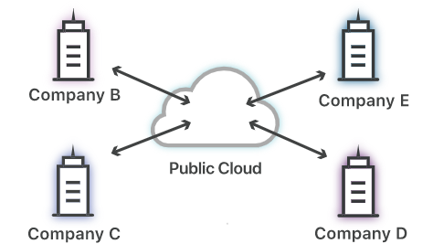

# What is cloud computing?

Cloud computing is the on demand delivery of computing services over the internet, including servers, storage, databases, networking, software, analytics, and intelligence. Cloud computing provides on-demand access to these services, enabling users to rapidly scale up or down their usage of computing resources as needed, paying only for what they use.

### A quick history of cloud computing

It wasn't until the mid-2000s that the concept of cloud computing began to take shape.

One of the early pioneers of cloud computing was Amazon Web Services (AWS), which launched in 2006. AWS offered a range of cloud-based computing services, including virtualized servers, storage, and databases, that businesses could use to quickly and easily provision computing resources over the internet.

### What are the benefits of cloud computing?

The key benefits of cloud computing include:

- Scalability: Cloud computing services can be scaled up or down as needed, enabling organizations to quickly respond to changing demand for computing resources.

- Cost-effectiveness: Cloud computing eliminates the need for organizations to invest in and maintain their own computing infrastructure, enabling them to reduce capital and operational costs.

- Reliability: Cloud computing services are typically provided by highly reliable and redundant data centers, enabling organizations to achieve high levels of uptime and availability.

- Security: Cloud computing providers typically offer advanced security features, including encryption, access controls, and monitoring, to protect users' data and applications.

# Bnefits of cloud computing for a business.

Cloud computing can bring several benefits to a business, including:

- Cost savings: One of the primary benefits of cloud computing is cost savings. By using cloud computing services, businesses can avoid the upfront costs associated with purchasing and maintaining hardware and software. Instead, they can pay for only the resources they use, which can lead to significant cost savings over time.

- Scalability: Cloud computing offers businesses the ability to quickly and easily scale their computing resources up or down as needed. This can be especially useful for businesses that experience spikes in demand, such as during seasonal peaks.

- Improved efficiency: With cloud computing, businesses can offload many of the tasks associated with managing hardware and software to third-party providers. This can free up internal resources and allow businesses to focus on their core competencies.

- Increased agility: Cloud computing can help businesses respond quickly to changing market conditions. With the ability to quickly scale resources up or down, businesses can rapidly adapt to new opportunities or challenges.

- Improved collaboration: Cloud computing can enable improved collaboration between teams, regardless of their location. This can be especially useful for businesses with remote workers or distributed teams.

- Enhanced security: Cloud computing providers typically offer advanced security features, including encryption, access controls, and monitoring. This can help businesses protect their data and applications from unauthorized access or breaches.

- Disaster recovery: Cloud computing can be an effective way to ensure that critical data and applications are backed up and can be quickly recovered in the event of a disaster or outage.

### What is AWS?

AWS stands for Amazon Web Services, which is a cloud computing platform provided by Amazon.com. It offers a wide range of cloud-based computing services, including storage, computing power, networking, databases, analytics, machine learning, and more.

AWS was launched in 2006 as a way for businesses to easily access computing resources over the internet without having to purchase and maintain their own physical infrastructure. Today, AWS has become one of the leading cloud computing platforms in the world, with millions of customers ranging from startups to large enterprises.

### The other cloud providers

The 6 main cloud providers are 

1. AWS
2. Microsoft Azure
3. Google cloud platform
4. IBM cloud
5. Alibaba cloud
6. Oracle cloud

### What is IaaS, PaaS, SaaS?

Infrastructure as a Service (IaaS): IaaS provides users with virtualised computing resources, such as servers, storage, and networking, over the internet. The user is responsible for managing the operating system, applications, and data running on top of the infrastructure. Examples of IaaS providers include Amazon Web Services (AWS) and Microsoft Azure.

Platform as a Service (PaaS): PaaS provides users with a platform for building and deploying applications without having to manage the underlying infrastructure. The provider takes care of the operating system, server software, and other infrastructure components, allowing the user to focus on developing and deploying their application. Examples of PaaS providers include Google App Engine and Heroku.

Software as a Service (SaaS): SaaS provides users with access to software applications over the internet, typically through a web browser. The provider hosts and manages the software, and users typically only use the sofware not manipulate it. Examples of SaaS providers include Salesforce and Dropbox.

### Public Cloud

A public cloud refers to a cloud computing model in which cloud services are provided over the internet by a third-party cloud service provider. In a public cloud, the underlying infrastructure and resources are shared among multiple customers, often referred to as tenants or users. 

Multi-tenancy: Public cloud resources are shared among multiple customers, with each customer's data and applications logically isolated from one another. The resources are dynamically allocated and provisioned to meet the needs of different customers.

Public cloud services are particularly popular due to their cost-effectiveness, agility, and ease of use.

### Private Cloud

A private cloud refers to a cloud computing model in which cloud services are provided within a dedicated and isolated infrastructure, exclusively for a single organization or entity. Unlike a public cloud, a private cloud is not shared with other organisations or the general public.

Key characteristics of a private cloud include:

- Dedicated infrastructure
- Isolation: The private cloud is isolated from external users and organisations
- Customisation and control
- Enhanced security

### Hybrid cloud

Hybrid cloud refers to a cloud computing environment that combines the use of both public and private clouds, allowing organisations to access the benefits of both models. In a hybrid cloud, the public and private clouds remain distinct entities but are connected and operate as a single, integrated infrastructure.

Data and Application Portability: Hybrid cloud environments enable organizations to move workloads, data, and applications between public and private clouds based on their specific needs, cost considerations, and performance requirements.

Enhanced Security and Compliance: Hybrid cloud allows organisations to maintain control over their sensitive data and applications while leveraging the security measures and compliance capabilities provided by the private cloud.

Disaster Recovery and Business Continuity: Hybrid cloud environments can be designed to support robust disaster recovery and business continuity strategies by replicating data between the two cloud services.

### Who and What type of industry use private cloud?

NASA: utilises private cloud solutions to support its research, simulations, and scientific computing requirements, which often involve sensitive data and complex computing workloads.

CERN: The European Organization for Nuclear Research relies on private cloud infrastructure to process and analyse vast amounts of data generated by experiments at the Large Hadron Collider, enabling collaborative scientific research.

ExxonMobil: The multinational oil and gas corporation has implemented a private cloud infrastructure to enhance its operational efficiency and streamline its IT operations.

Volkswagen: The company has opted for a private cloud strategy to centralise its IT infrastructure and enable better collaboration across its global network of production facilities and offices.

### What is Operating Expenditure? (OPEX)

Operating Expenditure (OPEX) refers to the ongoing expenses that a business incurs in order to maintain its operations and generate revenue. These expenses are incurred regularly and are necessary to keep the business running, such as salaries and wages, rent, utilities, insurance, marketing, and maintenance costs.

### What is Capital Expenditure? (CAPEX)

OPEX is different from Capital Expenditure (CAPEX), which refers to the expenses a business incurs to acquire or upgrade its physical assets such as buildings, equipment, and machinery. While CAPEX involves one-time or infrequent expenses, OPEX is a recurring cost that is incurred regularly as part of the business operations.

### Which is preferable? and how does the cloud allow businesses to transfer to spending more on the preferred one?

The preference between operating expenditure (OPEX) and capital expenditure (CAPEX) can vary depending on the specific circumstances and objectives of a business. However, cloud computing can provide certain advantages that enable businesses to shift their spending towards OPEX.

Here's how the cloud allows businesses to transfer to spending more on OPEX:

Pay-as-you-go Model: Cloud service providers typically operate on a pay-as-you-go or consumption-based pricing model. Instead of making large upfront investments in hardware, software, and infrastructure (CAPEX), businesses can pay for cloud services based on their actual usage (OPEX). This allows them to align their expenses with their actual needs and scale up or down as required, resulting in more predictable and flexible spending.

Reduced Infrastructure Costs: By moving to the cloud, businesses can eliminate or significantly reduce these infrastructure costs. They can leverage the provider's infrastructure.

Operational Efficiency: Cloud computing provides businesses with access to scalable and managed services. This eliminates the need for businesses to invest in setting up and maintaining their own infrastructure, platforms, and software.

### Companies that have migrated to the cloud.

Here are three case studies of companies that have successfully migrated to the cloud:

Netflix:
Netflix is a global streaming service that migrated its infrastructure to the cloud. Previously, Netflix relied on a traditional on-premises data center model, but they faced scalability and infrastructure management challenges. They decided to transition to Amazon Web Services (AWS) cloud infrastructure to leverage its scalability and global presence. By migrating to the cloud, Netflix gained the ability to scale its streaming service rapidly, handle high traffic volumes, and deliver content to users worldwide. The cloud allowed Netflix to optimize costs, improve reliability, and innovate faster by utilizing cloud-native services.

Capital One:
Capital One, a leading financial services company, embarked on a multi-year cloud migration journey to AWS. They aimed to modernize their infrastructure, enhance agility, and drive innovation. By migrating their applications and workloads to the cloud, Capital One gained the ability to scale their services on-demand, improve customer experiences, and accelerate the deployment of new products. They leveraged cloud-native services for data analytics, machine learning, and security. The migration enabled Capital One to streamline operations, optimize costs, and deliver enhanced digital services to their customers.

Airbnb:
Airbnb, the popular online marketplace for short-term rentals, migrated to the cloud to handle its massive growth and global presence. They chose to migrate to Amazon Web Services (AWS) to benefit from its scalability, global infrastructure, and managed services. By migrating to the cloud, Airbnb gained the ability to scale their platform based on demand, handle peak loads, and expand into new regions efficiently. The cloud provided them with robust data storage and analytics capabilities, enabling them to personalize user experiences and improve operational efficiency. The migration allowed Airbnb to focus on their core business while relying on the cloud provider's expertise in infrastructure management.

These case studies demonstrate how companies across different industries have successfully migrated to the cloud to gain scalability, agility, cost optimization, and access to advanced cloud services. Each company's migration journey involved careful planning, collaboration with cloud service providers, and a focus on leveraging the unique benefits of the cloud to achieve their business objectives.