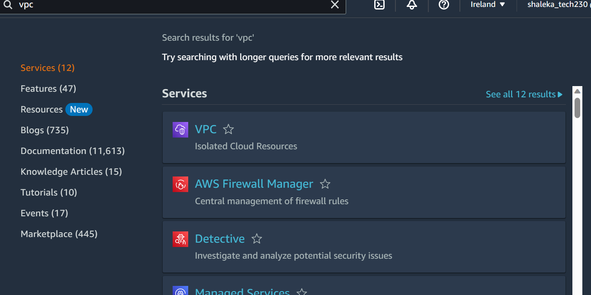

### Create a vpc

Search for VPC in the aws console:



Click create vpc:


select VPC only, name it and set the ipv4(CIDR) to: ```10.0.0.0/16```:


Then create VPC.

Select internet gateway from the left menu and click create internet gateway:


Name it and create it:


Find your IGW, select it, click the actions button and select attach to vpc:


Then find your VPC and attach it explicitly.

Next find subnets on the left menu and click create subnet:


Select your vpc and name your subnet:


Choose your AZ and the cidr block you want and click create subnet:


Next select route tables from the left menu.

Create route table:


Name it and create it:


Find and select your subnet, click actions then click edit subnet associations:


Select your subnet and save associations:


Find and select your route table again, click actions then this time select edit route:


Then we click add route and set it so that the destination is ```0.0.0.0/0``` and you target is your internet gateway:


Lastly we set up an EC2 instance like normal until we get to network settings and the SG. Select edit. Then select your vpc and public subnet and select enable auto assign public ip:


We have to create a new SG because its a new VPC, open ports 22, 80 and 3000:


Set your user data to install and run nginx in advanced details then create the EC2:

```
#!/bin/bash

sudo apt-get update -y
sudo apt-get upgrade -y
sudo apt install nginx -y
sudo systemctl start nginx
sudo systemctl enable nginx
```

Select your EC2 instance once its finished setting up and copy and paste the public IP into the url using HTTP:
