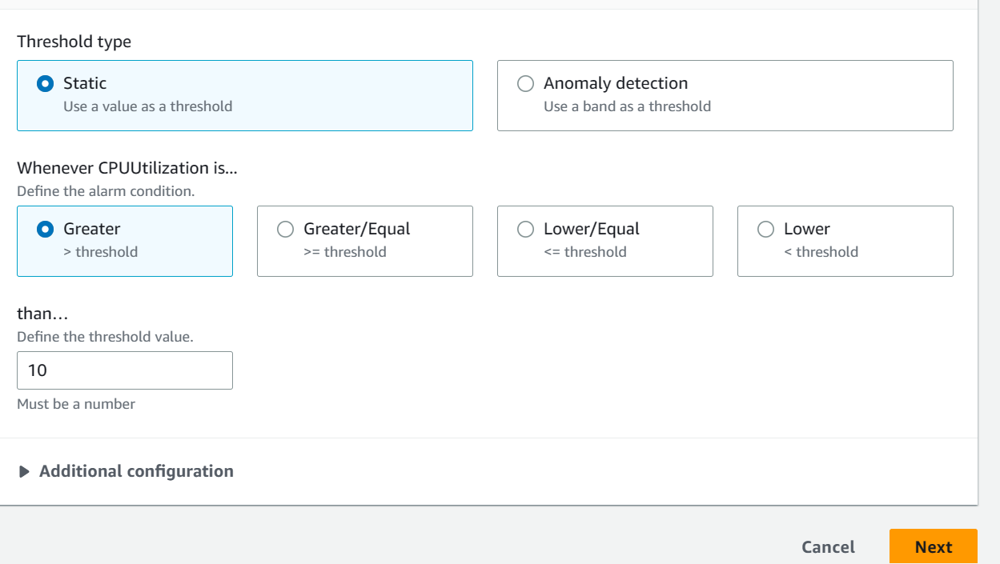

# Cloud watch

Create an ec2 instance that runs the sparta app and make sure it runs:

Select the instance and scroll down and select the monitoring tab (or search cloudwatch in the search bar)

Select manage detailed monitoring:


Check the enable detailed monitoring box and click confirm:


Next click add to dashboard.

Click create new and name your dashboard and finally click add to dashboard:


Then on the left hand menu select alarms the all alarms:

Create alarm:

### Set metrics

Choose select metric

In the search bar put your ec2 id in their then select ```EC2 > per-instance metrics```

Select the metric you want mine is CPU utilisation:


Next you specify your metic condtions, keep the statistics to avarage and set the period to 1 minute:


For theshold type, choose static and set the alarm to greater than your chose threshold percentage and choose next:





### Setting the notification

Under notification, choose in alarm, and select an SNS topic to notify when your alarm is triggered and click next:


Name and put a message in your alarm and click next:


Create alarm and whne it is triggered you should get an email:

